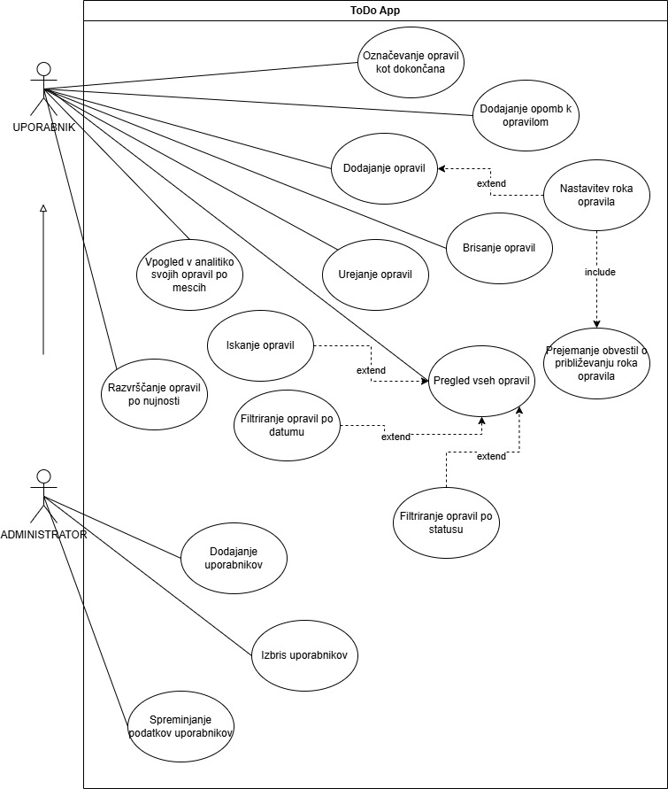
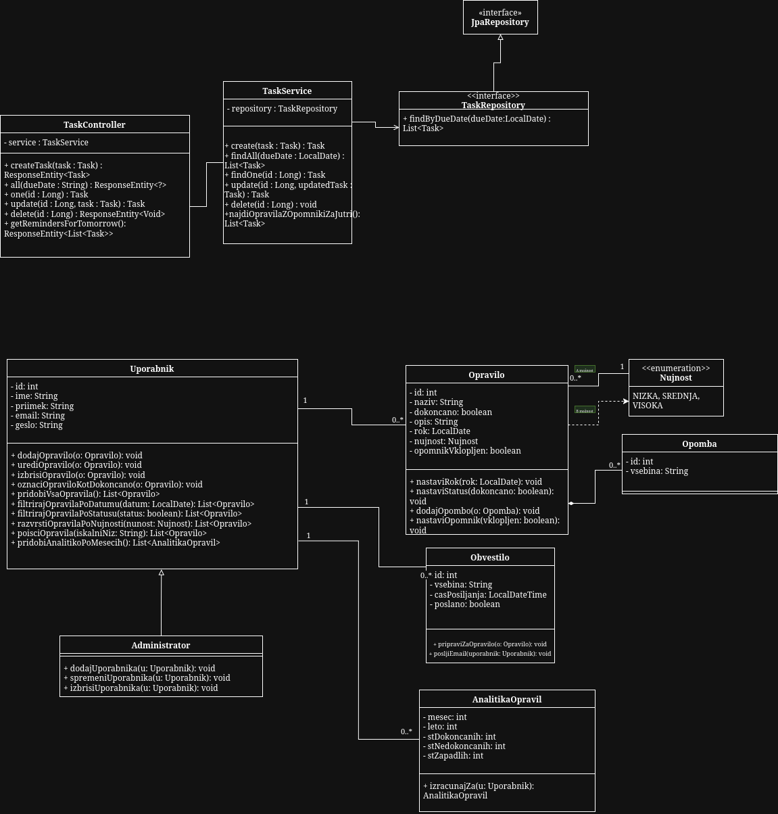

# 📝 ToDo App – RIS projekt

Projekt **ToDo App** je preprosta spletna aplikacija za upravljanje opravil, razvita v okviru predmeta **Razvoj informacijskih sistemov (RIS)** na UM FERI.  
Sestavljena je iz **zalednega (backend)** dela v **Spring Boot** in **odjemalnega (frontend)** dela v **React (Vite)**, povezana pa je z **MySQL/MariaDB** podatkovno bazo.

---

## 1) Dokumentacija za razvijalce

### Struktura projekta
```
todo_app/
│
├─ backend/                              # Spring Boot (REST API + JPA)
│  ├─ src/
│  │  ├─ main/
│  │  │  ├─ java/com/example/todo/
│  │  │  │  ├─ task/
│  │  │  │  │  ├─ Task.java
│  │  │  │  │  ├─ TaskController.java
│  │  │  │  │  ├─ TaskRepository.java
│  │  │  │  │  └─ TaskService.java
│  │  │  │  └─ TodoApplication.java
│  │  │  └─ resources/
│  │  │     └─ application.properties
│  │  │
│  │  └─ test/
│  │     └─ java/com/example/todo/
│  │        ├─ TodoApplicationTests.java
│  │        └─ task/
│  │           ├─ TaskServiceUpdateTest.java       # Unit testi za UPDATE
│  │           └─ TaskServiceReminderTest.java     # Unit testi za REMINDER
│  │
│  ├─ pom.xml
│  ├─ mvnw / mvnw.cmd                    # Maven wrapper
│  └─ .mvn/
│
├─ frontend/                             # React (Vite)
│  ├─ public/
│  │  └─ vite.svg
│  ├─ src/
│  │  ├─ assets/
│  │  │  └─ react.svg
│  │  ├─ api.js
│  │  ├─ App.jsx
│  │  ├─ index.css
│  │  └─ main.jsx
│  ├─ package.json
│  ├─ package-lock.json
│  └─ vite.config.js
│
├─ db/
│  └─ todo.sql                           # SQL skripta za bazo
│
├─ testiranje/
│  └─ porocilo_testiranja.md             # Poročilo o unit testiranju
│
├─ .gitignore
└─ README.md
```

### Arhitektura & standardi
- **Backend:** Java 17+ (deluje tudi na novejših), Spring Boot 3, REST konvencije, JPA (Repository pattern).
- **Frontend:** React 18+, Vite, JSX, Hooks (`useState`, `useEffect`).
- **Baza:** MySQL 8+ ali MariaDB 10.6+.
- **Stil kode:** angleška imena razredov/spremenljivk/metod; jedrnati komentarji; formatiranje po privzetih formatterjih (IntelliJ/Prettier).

### 🔌 API povzetek
- `GET  /api/tasks` – vrne seznam opravkov  
- `POST /api/tasks` – doda opravilo  
- `GET  /api/tasks/{id}` – vrne eno opravilo  
- `PUT  /api/tasks/{id}` – posodobi opravilo  
- `DELETE /api/tasks/{id}` – izbriše opravilo  

> CORS: Controller ima `@CrossOrigin(origins = "http://localhost:5173")` za lokalni razvoj.

---

## 2) Navodila za nameščanje

### 🗄️ Baza podatkov
1. Zaženi MySQL/MariaDB (lokalno ali v Dockerju).
2. Ustvari bazo in uporabnika z datoteko `db/todo.sql`:
   ```bash
   sudo mariadb < db/todo.sql
   ```
3. Nastavitve v `backend/src/main/resources/application.properties`:
   ```properties
   spring.application.name=todo

   # Povezava na bazo
   spring.datasource.url=jdbc:mysql://127.0.0.1:3306/todo_app?useSSL=false&allowPublicKeyRetrieval=true
   spring.datasource.username=todo_user
   spring.datasource.password=todo_pass

   # JPA/Hibernate
   spring.jpa.hibernate.ddl-auto=update
   spring.jpa.show-sql=true
   spring.jpa.properties.hibernate.format_sql=true

   # MariaDB dialekt (če uporabljaš MariaDB)
   spring.jpa.database-platform=org.hibernate.dialect.MariaDBDialect
   ```

> Opomba: Če uporabljaš **MySQL 8**, nastavitev `spring.jpa.database-platform` navadno ni potrebna.

---

### Backend (Spring Boot)
**IntelliJ IDEA:**
1. Odpri mapo `backend`.
2. Počakaj, da Maven naloži odvisnosti.
3. Zaženi `TodoApplication.java` (Run).  
   Aplikacija posluša na: `http://localhost:8080`.

---

### Frontend (React + Vite)
```bash
cd frontend
npm install
npm run dev
```
Aplikacija: `http://localhost:5173`

---

## 3) Navodila za razvijalce (Git)

**Repozitorij:** https://github.com/ismarM/ris-todo-projekt

### Prvič:
```bash
git clone https://github.com/ismarM/ris-todo-projekt.git
cd ris-todo-projekt
git config user.name "Ime Priimek"
git config user.email "email@example.com"
```

### Vedno pred delom:
```bash
git pull origin main
```

### Po spremembah:
```bash
git add .
git commit -m "Kratek opis spremembe"
git push origin main
```

> Delamo na `main`. Ne dodajaj `node_modules/`, `.idea/`, `.DS_Store` (že v `.gitignore`).

---

## 4) Vizija projekta
Vizija projekta ToDo App je razviti preprosto, pregledno in uporabniku prijazno rešitev za upravljanje opravil. Aplikacija omogoča dodajanje, urejanje, brisanje in pregledovanje nalog ter ponuja filtriranje po datumu, kar uporabniku pomaga pri boljšem načrtovanju obveznosti in ohranjanju pregleda nad časom.

Glavni cilj aplikacije je zmanjšati zmedo pri spremljanju nalog ter ponuditi orodje, ki ga lahko uporabniki brez težav uporabljajo vsak dan. Namenjena je študentom, profesorjem in vsem, ki želijo imeti bolj organiziran pregled nad svojimi opravki. Z razvojem želimo pokazati, kako lahko spletne tehnologije na preprost način izboljšajo osebno produktivnost in organiziranost. 

---

## 5) Besednjak

| Izraz | Pomen |
|-------|-------|
| **Opravilo (Task)** | Posamezna naloga, ki jo uporabnik doda v aplikacijo. |
| **Naslov opravila** | Kratek opis opravila, prikazan v seznamu. |
| **Opis opravila** | Dodatni podatki ali opombe o opravilu. |
| **Datum opravila** | Datum, do katerega naj bo opravilo opravljeno. Po tem datumu je možno tudi filtriranje. |
| **Filtriranje po datumu** | Prikaz samo tistih opravil, ki ustrezajo izbranemu datumu. |
| **Status opravila** | Označuje, ali je opravilo opravljeno (checkbox). |
| **CRUD** | Osnovne operacije nad podatki: Create, Read, Update, Delete. |
| **Frontend** | Del aplikacije, s katerim uporabnik neposredno upravlja (React). |
| **Backend** | Del aplikacije, ki obdeluje podatke in komunicira z bazo (Spring Boot). |
| **API** | Vmesnik, preko katerega frontend in backend izmenjujeta podatke. |
| **REST API** | API, ki uporablja HTTP metode (GET, POST, PUT, DELETE) za delo z opravilom. |
| **Podatkovna baza** | Shranjuje vsa opravila aplikacije (MySQL/MariaDB). |

---

## 6) Diagram primerov uporabe



---

## 7) Razredni diagram



### Opis razredov

- **Uporabnik**
  - Predstavlja registriranega uporabnika aplikacije.
  - Hrani osnovne podatke (ime, priimek, email, geslo) in seznam opravil.
  - Ključne metode:
    - `dodajOpravilo`, `urediOpravilo`, `izbrisiOpravilo` – osnovni CRUD nad opravili.
    - `filtrirajOpravilaPoDatumu`, `filtrirajOpravilaPoNujnosti` – podpora funkcionalnostim filtriranja.
   
- **Opravilo**
  - Predstavlja eno opravilo v to-do seznamu.
  - Atributi: `naziv`, `opis`, `rok`, `dokončano`, `nujnost` (enum `Nujnost`), `opomnikVklopljen`.
  - Ključne metode:
     - `nastaviRok`, `nastaviStatus` – urejanje opravila.
     - `nastaviOpomnik` – vklop/izklop e-mail opomnika.
     - `dodajOpombo` – povezava na razred `Opomba`.
      
- **Nujnost**
  - Določa težavnost/importantnost opravila: `NIZKA`, `SREDNJA`, `VISOKA`.
  - Uporablja se pri prikazu in pri prioriteti nalog.

- **Opomba**
  - Dodatno besedilo, vezano na eno opravilo.
  - Uporabnik lahko k istemu opravilu doda nič ali več opomb.

- **Obvestilo**
  - Predstavlja opomnik za opravilo (npr. e-mail dan pred rokom).
  - Atributi: `vsebina`, `casPosiljanja`, `poslano`.
  - Ključne metode:
     - `pripraviZaOpravilo` - na osnovi opravila nastavi čas pošiljanja.
     - `posljiEmail` - pošlje opomnik uporabniku.

- **AnalitikaOpravil**
  - Hrani agregirane statistike za uporabnikova opravila po mesecih.
  - Atributi: `mesec`, `leto`, `stSkupno`, `stDokoncanih`, `stNedokoncanih`, `stZapadelih`.
  - Ključna metoda:
     - `izracunajZa(uporabnik)` - izračuna statistiko na podlagi seznamov opravil.

- **Administrator**
  - Poseben tip uporabnika, ki lahko upravlja uporabnike.
  - Metode: `dodajUporabnika`, `spremeniUporabnika`, `izbrisiUporabnika`.
 
- **TaskController / TaskService / TaskRepository**
  - Sloj za komunikacijo med frontendom in bazo (Spring Boot).
  - `TaskController` sprejema HTTP zahteve.
  - `TaskService` implementira poslovno logiko (npr. `createTask`, `findAll`, `nadjiOpravilaZOpomnikiZaJutri`).
  - `TaskRepository` komunicira z bazo preko Spring Data JPA.

---

## 8) Nova funkcionalnost: Prejemanje obvestil o približevanju roka opravila
Implementirali smo napredni reminder sistem oz. sistem opomnikov, ki uporabnika samodejno opozori na prihajajoče roke opravil. Ta vključuje:
  - frontend UI podporo,
  - nove entitete in polja v backendu,
  - cron urnik za avtomatsko pošiljanje,
  - realno pošiljanje e-pošte preko SMTP (MailTrap),
  - preprečitev podvajanja opomnikov.

Ta funkcionalnost razširi aplikacijo iz navadnega "to-do" seznama v realno uporabno orodje za upravljanje z roki.
Funkcionalnost je popolna, testirana in pripravljena za nadaljnje razširitve.

**Kako funkcionalnost deluje:**
1. Vnos podatkov na frontendu
Pri ustvarjanju ali urejanju opravila lahko uporabnik določi:
  - e-poštni naslov, na katerega želi prejemati opomnike,
  - možnost »Pošlji opomnik dan pred rokom«,
  - datum roka (dueDate).

Ko uporabnik shrani opravilo, frontend vse te informacije pošlje backendu prek API-ja. V uporabniškem vmesniku je jasno prikazano, ali je opomnik za posamezno opravilo vklopljen ali ne.

2. Logika delovanja v backendu
Da bi opomniki delovali samodejno, so bili na backendu dodani novi atributi:
  - email – naslov za prejemanje opomnikov,
  - reminderEnabled – označuje, ali ima opravilo vklopljen opomnik,
  - reminderSent – prepreči, da bi se opomnik poslal dvakrat.

Poleg CRUD funkcionalnosti, aplikacija uporablja tudi urnik (scheduler).

Cron se za potrebe testiranja izvaja vsako minuto. Ob vsakem zagonu scheduler:
  - poišče vsa opravila, ki imajo rok jutri,
  - preveri, ali je opomnik za opravilo vklopljen,
  - preveri, ali opomnik še ni bil poslan (reminderSent == false),
  - pošlje e-poštno obvestilo preko MailTrap SMTP,
  - nastavi reminderSent = true,
  - zapiše log o poslani pošti.

Na ta način aplikacija zagotavlja, da nobeno opravilo ne prejme opomnika dvakrat.

3. Vsebina e-poštnega opomnika
Sporočilo, ki ga uporabnik prejme, vsebuje:
  - prijazen pozdrav,
  - datum roka,
  - naslov opravila,
  - podpis aplikacije.

Ker se uporablja MailTrap, se pošta prikaže v njihovem testnem »Inboxu«.

**Uporaba funkcionalnosti:**
Najprej uporabnik v aplikaciji odpre obrazec za dodajanje novega opravila. V obrazec vnese vse standardne podatke, kot so naslov, opis in težavnost.
Pri ustvarjanju ali urejanju opravila izpolni še nova polja, ki so del funkcionalnosti opomnikov:
  - e-poštni naslov, kamor želi prejemati opomnik,
  - označi »Pošlji opomnik dan pred rokom«, s čimer vklopi opomnik,
  - datum roka.
Ko vse izpolni, klikne Dodaj opravilo.
Uporabnik odpre svoj MailTrap račun, izbere zavihek Inbox in počaka. V »Inboxu« se 1 dan pred rokom opravila prikaže novo e-poštno sporočilo, ki vsebuje opomnik na jutrišnji rok opravila.

Uporabnik lahko preveri tudi delovanje na UI:
  - ob opravilu se vidi, ali je opomnik vklopljen,
  - prikaže se badge »Tomorrow!«, »Today!«, »Overdue!« ali »X days left«,
  - opravilo vsebuje vse nove vnose (e-pošta, rok, status opomnika).


---

## 9) Testiranje

V projektu smo dodali unit teste za zaledje aplikacije, ki preverjajo pravilno delovanje ključnih funkcionalnosti (CRUD operacije in e-poštni opomniki).

Testi se nahajajo v mapi `src/test/java`, poročilo o testiranju pa v mapi `testiranje/porocilo_testiranja.md`, kjer je opisano:
- katere teste je razvil posamezen član ekipe,
- kaj posamezni testi preverjajo,
- kakšne napake so bile odkrite in odpravljene.

---

## Ekipa
- Ismar Mujezinović  
- Ana Cvetko  
- Živa Šumak

---
© 2025 FERI – Razvoj informacijskih sistemov
